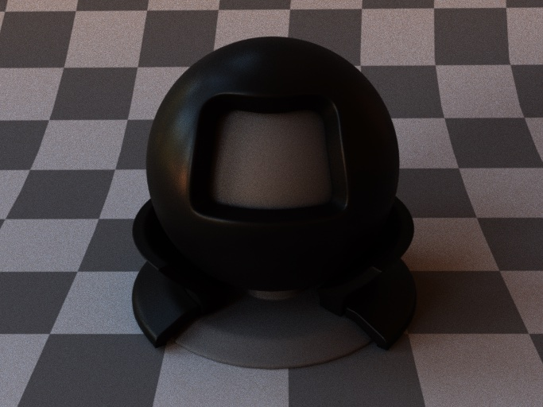

This project implements the Disney principled BSDF, a Bidirectional Scattering Distribution Function in La Jolla Renderer. The Disney principled BSDF aims to provide a universal solution for representing common materials using a single BSDF. While it is based on physical principles and real-world data, its primary focus is not strict physical accuracy. Instead, it serves as a practical tool for parameterizing a wide range of materials to facilitate artistic expression.

- Diffuse

- Mental

- Glass

- Clearcoat

- Sheen

