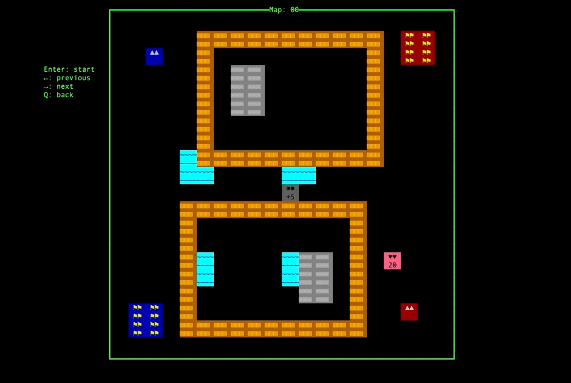

This project implements a pixel-game with haskell. Tank Battalion is a classic shooter arcade video game in which the 2 players control tanks that defend their own base as well as destroy the other player's tank. The player will lose if either player's tank or base is destroyed by the other player.

