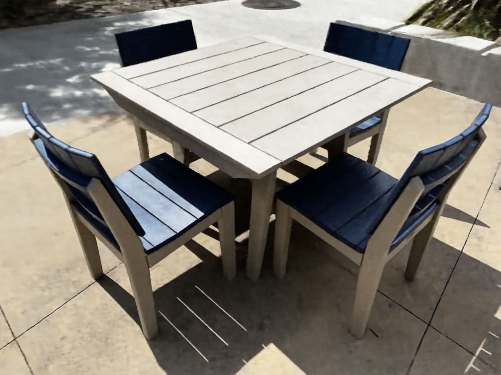

This project reimplements the paper "NeRF: Representing Scenes as Neural Radiance Fields for View Synthesis"[1]. The Neural Radiance Field, or NeRF, has exploded in popularity since its first debut in ECCV 2020. This image-based rendering technique shows impressive results in reconstructing photorealistic 3D scenes from a set of calibrated 2D images. Due to its widespread use in both academia and industry, we hope to learn NeRF by reimplementing it from scratch in PyTorch.

Click to see the result video:

